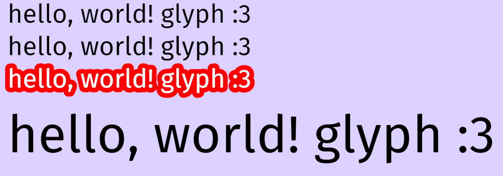

# Kaku

A text rendering crate for rust+wgpu, with the ability to use signed distance fields.

This crate was originally designed with the intent of allowing fast frame-by-frame rendering of outlined text for a video game I'm working on.

## Features

- Rendering of OpenType fonts (loaded with [ab_glyph](https://github.com/alexheretic/ab-glyph)).
- Simple, non-SDF text rendering for performance.
- SDF-based text rendering for high quality upscaling and fast outlining.

## What do signed distance fields do?

Without going into details, signed distance fields are a way of representing a shape (such as a character in a font) in a way that allows for high quality upscaling, reducing memory usage. It also allows you to render certain effects such as outlines in a way that is very performant.

The major downside to SDF rendering is that it takes some time to calculate the field, so creating textures for a string of text takes longer with this approach than with simple texture-based text rendering. So, this crate provides both, in case you don't need anything that SDF rendering provides.

## Example

Here is a screenshot of the demo example, showing some of the things kaku can do:

This example shows the same text:

- Rendered with no SDF, using just the textures provided by ab_glyph.
- Rendered with SDF.
- Rendered with SDF, with a large outline.
- Rendered with SDF, upscaled 2x. Even though it's upscaled, it's still crisp and smooth!
